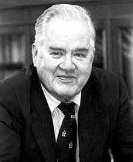

## I have the data now what?

This lecture is based on @maindonald book chapter 2.

Basic questions about the data are:

-   What forms of data exploration should we explore?
-   Can we easily identify errors in the data?
-   What type or form of checks should we do before start the formal analysis?
-   What exploratory or formal analysis is appropriate?

There is merit (or perhaps an innate tendency) for checking for patterns and relationships. Numerical summaries can be useful but some features may be missed unless we put them in an appropriate graphical representation.

Keep in mind that preliminary scrutiny of the data can readily degenerate into data snooping, so the form of the analysis is unduly attuned to features of the data that may reflect statistical sampling variation.

> Under torture, the data readily yield false confessions!


So, to what extend is it legitimate to allow the data to influence the choice of the model that will be used for formal analysis?

## Exploratory Data Analysis (EDA)

EDA is a collection of data display techniques that are intended to let the data speak for themselves, prior to or as part of a formal analysis.

The term EDA was coined by John W. Tukey



An effective EDA display presents data in a way that will make effect use of the human brain's abilities as patter recognition device. It looks for what may be apparent from a direct, careful and (as far as possible ) assumption-free examination of the data. It has at least four roles:

-   EDA may suggest ideas and understandings that had not previously been contemplated.

-   EDA results may challenge the theoretical understanding that guided the initial collection of the data.

-   EDA allows the data to criticize an intended analysis and facilitates checks on assumptions

-   EDA techniques may reveal additional information, not directly related to the research question.

### Histograms and density plots

The histogram is a basic (and 0ver0-used) EDA tool for displaying the frequency distribution of a set of data.

-   In small samples, the shape can be highly irregular

-   Appearance can depend on the choice of breakpoints

-   Without further considerations, the visual interpretation can be misleading.

```{r}
library(DAAG)
library(ggplot2)
fossum <-subset(possum,sex=="f")
attach(fossum)
```

```{r}
p<-ggplot(fossum,aes(totlngth))
```

The default option

```{r}
p+geom_histogram()
```

What if we change the number of breaks? Meaning where the cuts start from each bin.

```{r}
p+geom_histogram(breaks=72.5+ (0:5)*5)
```

What if we change the number of bins?

```{r}
p+geom_histogram(bins = 50)
```

The following function adjust the width of the bins according to some data properties (there are many possibilities for a function)

```{r}
p+geom_histogram(binwidth = function(x) 2*IQR(x)/(length(x)^(1/3)))
```

A better alternative is to use a **smooth density estimate**.

The height of the density curve at any point is an estimate of the proportion of sample values per unit interval at that point.

```{r}
p+ geom_density(color="red")
```

Let's make a very handsome histogram

```{r}
p1<-ggplot(fossum,aes(totlngth,fill=Pop))
q<- p1+geom_histogram(bins=30)
q+labs(title = "Female Opposum Data", subtitle = "Fist Investigation") +xlab("Total Length (cm)") + ylab("Frequency")+labs(caption = "BMIG 5211 experiment")
```

Or with smooth density diagrams

```{r}
p2<-ggplot(fossum,aes(totlngth,fill=Pop))
q<- p2+geom_density(alpha=0.1)
q+labs(title = "Female Opposum Data", subtitle = "Fist Investigation") +xlab("Total Length (cm)") + ylab("Frequency")+labs(caption = "BMIG 5211 experiment")

```

Note for **linux users**. Transparency sometimes does not work properly. Use the following option

```{r, eval=FALSE}
options(bitmapType="cairo")
```

### Boxplots

These plots are also a summary of the data. However, it offers the so-called *five summary statistics*:

-   median

-   two hinges (first and third quantiles)

-   two whiskers

It can also identify *outliers* (i.e., points that lie away from the main body of data).

```{r}
p2<-ggplot(fossum,aes(totlngth,fill=Pop))
q<- p2+geom_boxplot()
q+labs(title = "Female Opposum Data", subtitle = "Second Investigation") +xlab("Total Length (cm)") +labs(caption = "BMIG 5211 experiment")
```

The *interquantile range (IQR)* can be determined as the difference between the 25th and 75th percentiles. The lower whisker extends from the hinge to the smallest value at most 1.5\*IQR of the hinge. Data outside the end of the whiskers are called outliers.

### Patterns in bivariate data

The scatterplot is a simple but important tool for the examination of pairwise relationships.

The following data comes from a study that examined how the electrical resistance of a slab of kiwifruit changed with the apparent juice content.

```{r}
attach(fruitohms)
ggplot(fruitohms,aes(juice,ohms))+ geom_point()
```

Or a nicer plot

```{r}
p<-ggplot(fruitohms,aes(juice,ohms))+ geom_point()
p+labs(title = "Electrical Resistance", subtitle = "Kiwi fruit") +xlab("Apparent juice content (%)")+ylab("Resistance (Ohms)") +labs(caption = "BMIG 5211 experiment")
```

### Linear and other smooth trends

We can explore our data according to certain fitting methods.

-   Linear Regression

```{r}
ggplot(fruitohms,aes(juice,ohms))+ geom_point()+geom_smooth(method="lm")
```

> Every data fitting method has some underlying assumptions. Here we are exploring visually not formally.

-   Loess (locally weighted regression) Loosely speaking, this method estimates a regression function locally from the points *around* them.

```{r}
ggplot(fruitohms,aes(juice,ohms))+ geom_point()+geom_smooth()
```

> Make it a practice to close the *attached* data sets

```{r}
detach(fossum)
```

### Scaling

We will use a brain vs. body weight from a dataset from the *MASS* package called *Animals*.

```{r}
library(MASS)
attach(Animals)
q<- ggplot(Animals,aes(brain,body))+ geom_point()
q

```

```{r}
q<- ggplot(Animals,aes(brain,body))+ geom_point()
q+ scale_x_continuous(trans = 'log2')+scale_y_continuous(trans='log2')
```

### What to look for in plots

-   Outliers. Points that appear to be isolated from the main body of the data.

-   Asymmetry of the distribution. For instance positive skewness where all the points are cluster together for smaller values and larger values are widely dispersed. (See the scale plot problem). Sometimes, a data transformation is required to remove those artifacts.

-   Changes in variability. Many statistical models rely on the assumption that the variability is constant across treatment groups (*homoscedasticity*).

-   Clustering. Clusters in scatter plots may suggest structure in the data that may or may not have been expected.

-   Non-linearity. We should not fit a linear model to data where relationships are demonstrably non-linear.

> The data, unless they are flawed, have the final say!

```{r}
detach(Animals)
```
