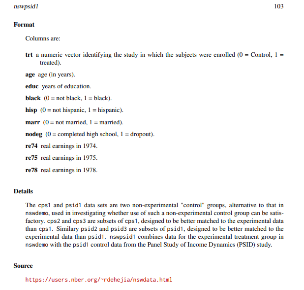

## Purpose of Data Summary

> This lecture is based on @maindonald book chapter 2.

There are some obvious benefits of summarizing our data

- It has interest in its own right
- It can give insights into aspects of data structure that may affect further analysis
- It can be used as data for further analysis.

## Counts

In this section we will use some basic problems that are often overlooked when summarizing data.

### Directionality

Often times, inadvertently we compare groups that are not exactly comparable.

**Example**. In a study there were two groups of individuals with a history of unemployment problem. One group (control) and other (treatment) whose members were exposed to a labor training program.

The question is what are the relative numbers in each of the two groups who had completed high school (*nodeg=0*) as opposed to those who had not (*nodeg=1*)?

```{r}
library(DAAG)
attach(nswpsid1)
```

The definition of the variables is here



```{r}
treatement.group<-factor(trt,labels = c("none","training"))
education.group<-factor(nodeg,labels = c("completed","dropout"))
table(treatement.group,education.group)
```

The proportion of dropouts in the training group is much higher, whereas this condition is reversed in the no training group.

Next example shows how difficult is to interpret results when directionality changes.

The study was comparing outcomes for two different types of surgery for kidney stones; A: open which used open surgery, and B:ultrasound, which used a small incision, with the stone destroyed by ultrasound

|   | Open small | Ultrasound small | Open large | Ultrasound large | Total small | Total large |
|-----------|-----------|-----------|-----------|-----------|-----------|-----------|
| Yes | 81 | 234 | 192 | 55 | 273 | 289 |
| No | 6 | 36 | 71 | 25 | 77 | 61 |
| Success Rate (%) | 93 | 87 | 73 | 69 | 78 | 83 |

The visual representation of this one is given by the following chunk

```{r}
stones<-array(c(81,6,234,36,192,71,55,25),dim=c(2,2,2),
              dimnames = list(Sucess=c("yes","no"), 
                              Method=c("open","ultrasound"),
                              Size=c("<2cm",">2cm")))
mosaicplot(stones,sort=3:1)
```

If we look only to the totals, we will be missing the directionality changes between the surgery preference depending on the size of the stone.

### Simpson's Paradox

This example comes from @commonerrors.

An omitted variable may result in two variables appearing to be independent when the opposite is true.

|       | Control | Treated |
|-------|---------|---------|
| Alive | 6       | 20      |
| Dead  | 6       | 20      |

Apparently, the treatment has has no effect on the death rate. Let's suppose now that we have the following two tables for males and females separately

| MALES | Control | Treated |
|-------|---------|---------|
| Alive | 4       | 8       |
| Dead  | 3       | 5       |

| FEMALES | Control | Treated |
|---------|---------|---------|
| Alive   | 2       | 12      |
| Dead    | 3       | 15      |

For males, treatment reduces the male death rate from 3 of 7 (0.43) to 5 of 13 (0.38).

For females, death rate is reduced from 3 of 5 (0.6) to 12 of 27 (0.55).

Both sexes show a reduction, but the combined population does not!

## Summaries

There is an interesting function in R called *aggregate*() This function automatically splits the data frame according to specified combination of factor levels and a key advantage is that you can apply a function for each one of the subgroups created!

```{r}
library(DAAG)
attach(kiwishade)
kiwimeans<-aggregate(yield, by=list(block,shade), mean)
names(kiwimeans)<-c("block","shade", "mean_yield")
head(kiwimeans,4)
```

This chunk of code will print a nice summary of our data

```{r}
library(lattice)
dotplot(shade ~ yield | block, data=kiwishade, pch=1,aspect=1,
        panel=function(x,y,...){panel.dotplot(x,y,...)
        av<-sapply(split(x,y),mean)
        ypos<-unique(y)
        lpoints(ypos ~av, pch=3,cex=1.25)
        },
        key=list(space="top", columns=2,
                 text=list(c("Individual vine yields", "plot means (4 vines)")),
                 points=list(pch=c(1,3),cex=c(1,1.25))),layout=c(3,1)
        )
```
